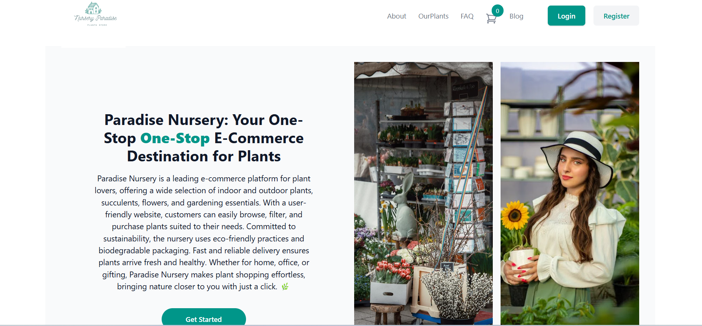
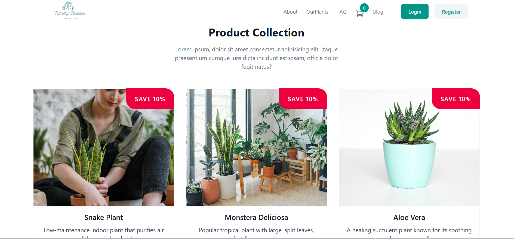
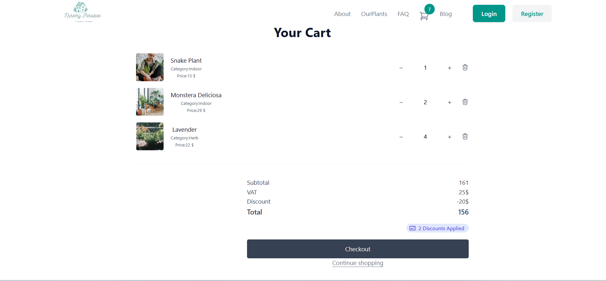
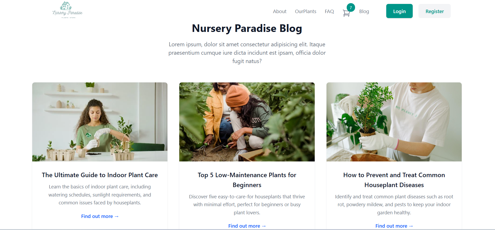

# Nursery Paradise - Plant E-Commerce Store 🌱

Welcome to **Nursery Paradise**, a simple e-commerce website built with **Vite, React, Redux, and React Router**. This platform allows users to explore plants, read blog articles, add items to the cart, and proceed to checkout.

## Features 🚀
- 🌿 **Explore Plants** – Browse a variety of plants available for purchase.
- 🛒 **Add to Cart** – Easily add your favorite plants to the shopping cart.
- ✅ **Checkout** – Complete your purchase smoothly.
- 📚 **Read Blog Articles** – Learn about plant care through engaging articles.

## Tech Stack 🛠️
- **Frontend:** React, Redux, React Router, Tailwind CSS
- **Bundler:** Vite
- **State Management:** Redux Toolkit

## Installation & Setup ⚙️

1. Clone the repository:
   ```bash
   git clone https://github.com/WalaaRababa/Simple_Ecommerce
   cd Simple_Ecommerce
   ```
2. Install dependencies:
   ```bash
   npm install
   ```
3. Start the development server:
   ```bash
   npm run dev
   ```
## Folder Structure 📂
```
├── src/
│   ├── components/               # Reusable components
│   │   ├── article/              # Article component
│   │   ├── banner/               # Banner component
│   │   ├── cart/                 # Cart component
│   │   ├── listOfProduct/        # List of Product component
│   ├── layout/                   # Layout components (Header, Footer)
│   │   ├── header/               # Header component
│   │   ├── footer/               # Footer component
│   ├── pages/                    # Page components
│   │   ├── blog/                 # Blog page
│   │   ├── home/                 # Home page
│   │   ├── shop/                 # Shop page
│   │   ├── plant/                # Plant page
│   │   ├── 404/                  # 404 page
│   │   ├── faq/                  # FAQ page
│   ├── store/                    # Redux store
│   ├── App.js                    # Main App component
│   ├── main.jsx                  # Entry point
├── public/
├── package.json                 # Dependencies & scripts
├── README.md                    # Documentation
├── screenshots/                 # Folder for screenshots
```

## Screenshots 📸

### 🌿 Home Page


### 🛍️ Product Listing


### 🛒 Shopping Cart


### 📚 Blog Section



---
### Happy Plant Shopping! 🌿🛍️

